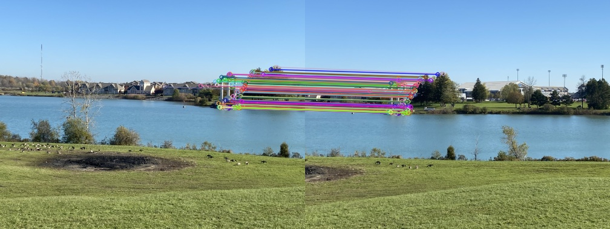
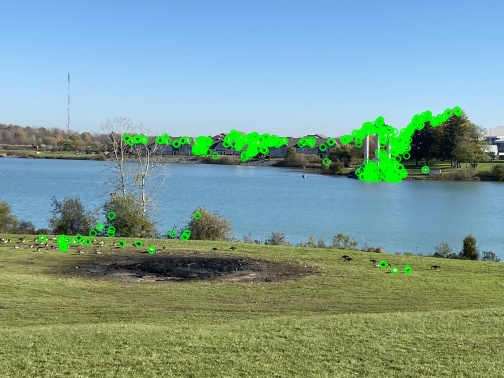
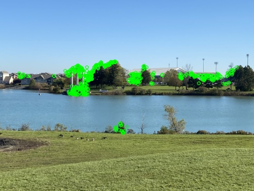

# VR_Assignment1_Chinmay_IMT2022561

---

## Part 1 - Coin Detection and Segmentation

### Description
This script detects and counts coins in an input image using **contour detection** and **circle fitting techniques**. Each detected coin is highlighted and labeled.

### Methodology

- **Image Preprocessing**: 
    - The input image is loaded using OpenCV.
    - Converted to grayscale for simpler processing.
    - Applied Gaussian blur to reduce noise and smoothen the image.

- **Edge Detection and Contour Extraction**:
    - Applied Canny edge detection to highlight the edges of the coins.
    - Performed dilation to connect fragmented edges and enhance the contours.
    - Extracted external contours from the processed image.

- **Filtering and Segmentation**:
    - Filtered contours based on area to remove small unwanted objects.
    - For each detected coin, the **minimum enclosing circle** is fitted to approximate its boundary.
    - Each segmented coin is labeled with a unique number directly on the image.

- **Circular Coin Extraction**:
    - Created a circular mask for each detected coin.
    - Applied the mask to extract only the coin region from the original image.
    - Cropped the circular coin into a square region and saved it as a transparent PNG.

- **Visualization and Output**:
    - Displayed the original and segmented images side by side.
    - Saved each segmented circular coin in an output folder for further analysis.


### How to Run
Ensure you are inside the `part1` folder and run:

```bash
python part1.py
```
### Input Files
Place input images inside the following directory:
part1/input/
For example:
```bash
part1/input/Part1_input_image_2.jpg
```
### Dependencies
- OpenCV
- NumPy
- Matplotlib
Install using:
```bash
pip install opencv-python numpy matplotlib
```
### Output
The segmented image (with labeled coins) is displayed using matplotlib.

### Observations
Works well for non-overlapping, well-separated coins.
Performance can degrade if coins are touching or partially occluded.
Example coin detection result will be saved to:
bash
Copy
Edit

### Sample Output


## Part 2 - Image Stitching
### Description
This script stitches two images into a single panorama using feature matching and homography estimation techniques.

### Methodology

- **Image Loading and Resizing**:
    - Both input images are loaded from disk.
    - Images are resized to half their original dimensions to reduce memory usage and processing time.

- **Grayscale Conversion**:
    - Both images are converted to grayscale to simplify feature detection.

- **Feature Detection and Description**:
    - Used ORB (Oriented FAST and Rotated BRIEF) to detect keypoints and compute feature descriptors for both images.

- **Keypoint Visualization**:
    - Keypoints are drawn onto both images for visual inspection.
    - Images with keypoints are saved for debugging and visualization.

- **Feature Matching**:
    - Used **Brute Force Matcher (BFMatcher)** with Hamming distance (suitable for ORB descriptors) and cross-checking enabled.
    - Matches are sorted by distance, and the top 100 matches are selected.

- **Match Visualization**:
    - A match visualization image is created, showing how keypoints in both images correspond to each other.
    - This match image is saved.

- **Homography Estimation**:
    - Extracted matched keypoints are used to compute a **homography matrix** using RANSAC.
    - The homography describes how to warp the second image to align with the first.

- **Image Warping and Stitching**:
    - The second image is warped onto the coordinate system of the first image.
    - The first image is overlaid onto the panorama to ensure no gaps in the left side.

- **Cropping Excess Black Areas**:
    - After warping, black areas may appear in the panorama.
    - Contours are used to find the non-black region, which is then cropped to produce a clean final result.

- **Final Output**:
    - The cropped stitched panorama is saved to disk.


### How to Run
Ensure you are inside the part2 folder and run:
```bash
python part2.py
```
### Input Files
Place input images inside the following directory:
part2/input/
For example:
```bash
part2/input/Part2_input_image1.jpg
part2/input/Part2_input_image2.jpg
```

### Dependencies
- OpenCV
- NumPy

Install using:
```bash
pip install opencv-python numpy
```
### Output
The stitched panorama will be saved to:
```bash
part2/output/Part2_output_image.jpg
```
### Observations
Works best when there is sufficient overlap between images.
Performance degrades if the images have little overlap, poor feature contrast, or lack distinguishable keypoints.
The final panorama is cropped to remove unnecessary black areas.

### Sample inputs


### Sample output




