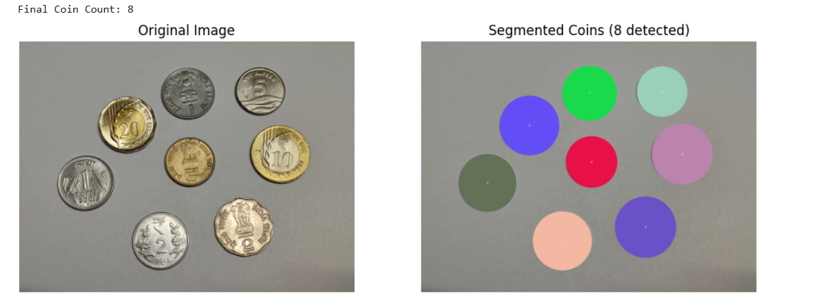
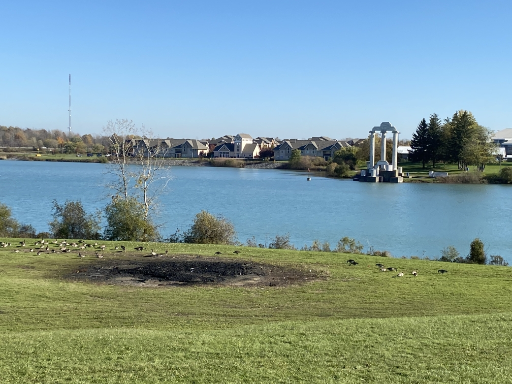
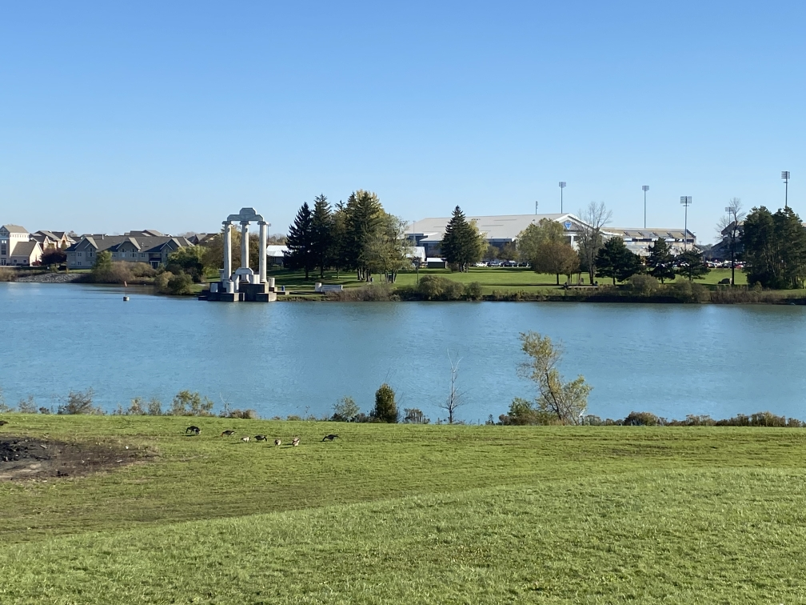
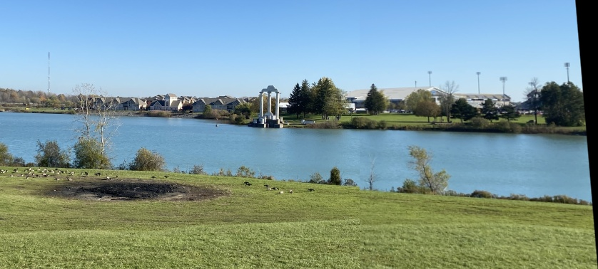

# VR_Assignment1_Chinmay_IMT2022561

---

## Part 1 - Coin Detection and Segmentation

### Description
This script detects and counts coins in an input image using **contour detection** and **circle fitting techniques**. Each detected coin is highlighted and labeled.

### Methodology
- Load input image.
- Convert to grayscale and apply Gaussian blur.
- Apply Canny Edge Detection.
- Detect external contours and filter out small areas.
- Fit **minimum enclosing circles** around each detected coin.
- Draw the circles on the image and label each coin with a number.
- Display the original and processed images side-by-side.

### How to Run
Ensure you are inside the `part1` folder and run:

```bash
python part1.py
```
### Input Files
Place input images inside the following directory:
part1/input/
For example:
```bash
part1/input/Part1_input_image_2.jpg
```
### Dependencies
- OpenCV
- NumPy
- Matplotlib
Install using:
```bash
pip install opencv-python numpy matplotlib
```
### Output
The segmented image (with labeled coins) is displayed using matplotlib.

### Observations
Works well for non-overlapping, well-separated coins.
Performance can degrade if coins are touching or partially occluded.
Example coin detection result will be saved to:
bash
Copy
Edit

### Sample Output


## Part 2 - Image Stitching
### Description
This script stitches two images into a single panorama using feature matching and homography estimation techniques.

### Methodology
- Load and resize input images to reduce memory usage.
- Convert images to grayscale.
- Detect keypoints and compute descriptors using ORB (Oriented FAST and Rotated BRIEF).
- Match features between images using Brute-Force Matcher with Hamming distance.
- Find the homography matrix using RANSAC.
- Warp the second image onto the first image.
- Crop the stitched panorama to remove black borders.
- Save the final stitched panorama.

### How to Run
Ensure you are inside the part2 folder and run:
```bash
python part2.py
```
### Input Files
Place input images inside the following directory:
part2/input/
For example:
```bash
part2/input/Part2_input_image1.jpg
part2/input/Part2_input_image2.jpg
```

### Dependencies
- OpenCV
- NumPy

Install using:
```bash
pip install opencv-python numpy
```
### Output
The stitched panorama will be saved to:
```bash
part2/output/Part2_output_image.jpg
```
### Observations
Works best when there is sufficient overlap between images.
Performance degrades if the images have little overlap, poor feature contrast, or lack distinguishable keypoints.
The final panorama is cropped to remove unnecessary black areas.

### Sample inputs



### Sample output

